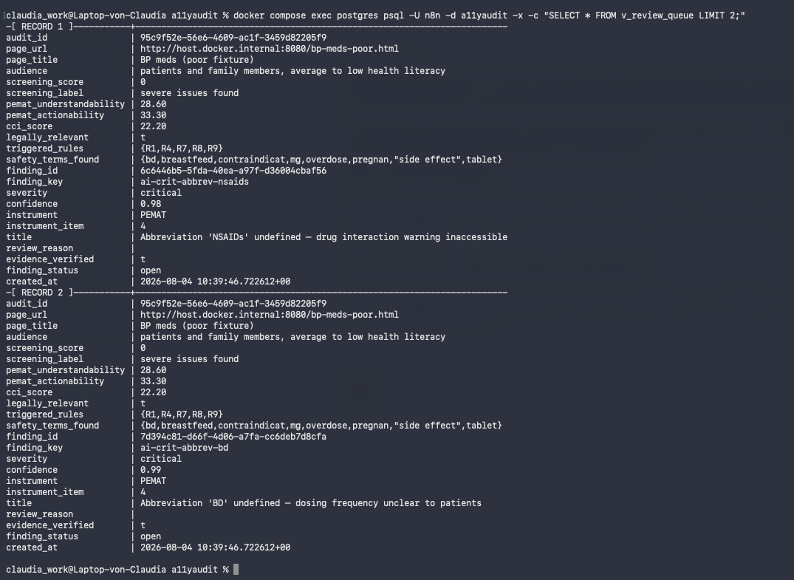

# A11yAudit

**AI-assisted accessibility and health-literacy screening for digital health content.**
Turing College - AI Capstone (Case 3: automation / build something useful for your work environment)

**Version 1.6 · 19 August 2026** · The submitted Phase-1 build (v1.3, 5 August) is unchanged and frozen; everything below reflects active Phase 2 work on `iteration-2-claude-code`. Since submission: per-run audit history (`audit_runs`) and per-item instrument verdicts (`instrument_items`) both went from designed-but-cut to built, written, and queryable; the AI prompt was hardened against the audited page's own content trying to manipulate its verdict; the Postgres role every write node authenticates as was narrowed from `n8n`'s own superuser to one with only the grants each table needs; PEMAT/CCI accuracy went from "unmeasured" to one real hand-scored data point (74.5%); 24 real external pages were run through the pipeline, finding and fixing four real defects along the way (content-extraction scoping, its own incomplete first fix, an unrelated pre-existing crash, and a SQL-comment expression bug - full detail below and in `decision_log.md` D-68/D-71/D-72); and rule R4's measured run-to-run flicker (D-37) was closed structurally by switching it to read the reproducible deterministic score, proven live against the exact fixture that first measured the flicker (D-76). Two gaps the 15 August external review named explicitly - no intake-form authentication, no per-call AI cost tracking - are now stated below rather than living only in the decision log.

---

## What this project does

A11yAudit is a self-hosted n8n automation that screens digital health content - patient portals, health information pages, discharge instructions - for accessibility barriers and comprehension problems.

You submit a URL or paste text. It returns a prioritised list of barriers with plain-language explanations and concrete fixes, a set of separate scores, a draft accessibility statement, and a record of which rules fired and why, stored in a Postgres database.

## The problem it solves

Health content must be accessible under the European Accessibility Act and the German BFSG, and it must be *understandable* by people who are often reading it while in pain, frightened, or medicated - that is, with reduced cognitive capacity precisely when comprehension matters most.

Two kinds of tools exist, and neither closes the gap:

- **Accessibility checkers** (axe, WAVE, Lighthouse) test markup well, but reduce language quality to a syllable-counting readability grade. They cannot see that "Take 1 tablet BD" is a dosing instruction given in unexplained Latin - and that misunderstanding of ordinary dosing instructions is measured at 63% among patients with low literacy and 38% among patients with adequate literacy, with *implicit rather than explicit dosing intervals* named as one of six causes ([Wolf et al. 2007](https://pubmed.ncbi.nlm.nih.gov/17587533/), 395 patients).
- **Health-literacy instruments** (PEMAT-P from AHRQ, the CDC Clear Communication Index) assess language properly - but they are manual scoring rubrics applied by trained human raters, one material at a time. Automated health-literacy tools do exist: the closest is the [SHeLL Health Literacy Editor](https://www.ncbi.nlm.nih.gov/pmc/articles/PMC9975914/) (Sydney Health Literacy Lab), which runs six automated language assessments. It does not check markup, and it is not grounded in PEMAT or the CDC Index.

I could find nothing connecting the two into a single automated screening of a health page - markup checks and instrument-grounded language analysis together. A11yAudit is that bridge: markup checks and instrument-grounded language analysis in one pass, with results stored so they can be compared across pages over time.


*The exact "BD" case above, as the tool actually found it - `v_review_queue`, queried live from Postgres, not a mockup.*

## How it works

```
Form (URL or text)
  → deterministic HTML checks (9 WCAG criteria, no AI)
  → safety prescreen (regex: dosing, emergency, risk terms)
  → SUB-A: one AI call, validated against a strict schema, with safe fallback
  → decision engine (deterministic scoring + 9 hard rules)
  → Postgres (audits · findings)
  → report + draft accessibility statement
```

**The central design principle is that the AI proposes and deterministic rules dispose.** The AI suggests findings and scores instrument items; it never decides anything that matters. Scoring, escalation, and the routing of safety-critical content to a human reviewer are handled by fixed rules that work even if the AI returns nothing at all. If the AI fails, the system falls back to "full human audit required" - it fails safe rather than silently. That path is not theoretical: it is demonstrated below.

The overall shape - a shared AI subworkflow plus a deterministic decision engine plus a metadata-only error handler - reuses a pattern I proved out in an earlier n8n project, not something designed fresh for this one.

Two controls make the AI's output usable:

1. **Evidence verification** - every finding must quote the source verbatim, and the quote is checked in code against the actual text after whitespace normalisation. A finding whose evidence cannot be located is discarded before it reaches the database, silently and without a retry: the model is given no opportunity to justify a quote it invented. Tested two ways - a controlled injection (a fabricated `critical` finding was dropped while a legitimate one survived) and observation in production, where this discarded between 0 and 4 findings per run on real model output.
2. **Deterministic precedence** - where a machine check and the AI disagree, the machine check wins, and the disagreement itself triggers human review.

**Validation is a shared subworkflow, called from both the first attempt and the one retry.** This logic used to be pasted twice as byte-identical Code nodes, because n8n Code nodes cannot import a sibling node - a real duplication a review caught. Extracted into its own subworkflow, `SUB-A_Validate`, taking its inputs explicitly rather than reaching for a specific upstream node by name, which also closed a real defect: the old version silently returned "valid, zero findings" - a clean-looking report - if that upstream node was ever renamed. The new contract makes a third repair attempt structurally impossible rather than just unlikely to wire wrong.

**Grounding.** The language analysis is not a generic "find unclear writing" prompt. It scores specific, named items from PEMAT-P (AHRQ) and the CDC Clear Communication Index, with item lists taken from the primary sources. Every finding traces to a published criterion, which makes it checkable - and disputable - rather than a matter of opinion.

**Every run is recorded, not just every piece of content.** Re-auditing the same page updates its one `audits` row (by content hash) but also appends a row to `audit_runs` - so a page audited five times has one current result and a full run history, not five competing rows or one row silently overwritten. Every instrument-item verdict (38 per audit, both instruments, all six domains) is written to `instrument_items` individually, with a human override protected from being reset by a later re-audit.

### Two screening scores, and why

The report prints **two** WCAG screening numbers, and the difference between them is the design argument made visible:

| | computed from | reproducible? |
|---|---|---|
| **`screening_score_deterministic`** | the nine automated HTML checks only | **yes** - verified byte-identical across runs |
| `screening_score` | automated *and* AI-proposed findings | **no** - the AI layer varies between runs |

This split was added late, after the before/after demo exposed the problem: on a well-written page there are zero automated findings, so *every* penalty point in the headline number came from AI judgment - inside a system whose whole claim is that the AI does not decide. **Quote the deterministic score as the result.** The combined score is advisory, and its verbal label ("issues found" / "severe issues found") is *not calibrated* for content findings - the bands were designed when only markup checks fed the score, and AI-proposed comprehension findings are numerous by nature. Recalibrating them needs a corpus, which is future work.

## Results

Two fixtures were used: a deliberately poor patient page about blood-pressure medication, and a corrected twin with the same clinical content rewritten. Both were run end to end through the live system on 4 August. The deterministic values were written down on 31 July - computed by running the check engines standalone, outside n8n, before the pipeline that carries them existed - and recorded in `fixtures/README.md`. The assembled system reproduced them exactly. This is a component-level expectation matched by the full pipeline, not a blind prediction; what it evidences is that the pipeline assembles its parts without silently altering their output.

| | poor page | corrected twin | expected, written 31 Jul |
|---|---|---|---|
| automated findings | 8 | **0** | 8 → 0 ✓ |
| **deterministic screening score** | **52** | **100** | 52 → 100 ✓ |
| deterministic instrument items | 5 of 8 fail | **8 of 8 pass** | 5 fails → 0 ✓ |
| PEMAT-informed understandability | 28.6 | 92.9 | not pinned - AI-dependent |
| PEMAT-informed actionability | 33.3 | 100 | not pinned |
| CCI-informed | 22.2 | 88.2 | not pinned |
| safety context detected | yes | yes | yes ✓ |
| routed to human review | **yes** | **yes** | yes ✓ |

Both score tables, extracted from the generated reports with the caveats that belong beside them, are in `demo_output/01_before_after_comparison.md`.

**What this shows.** The tool discriminates: the same clinical content, rewritten, moves from 52 to 100 on the reproducible score. And it does not trade safety for quality - the corrected page is well written, scores 100 deterministically, **and still goes to a human**, because it is still medication content. That combination is the entire argument in two rows.

**What else was demonstrated:** both input branches (URL and pasted text); the deterministic checks validated against a positive and a negative control; all scores reproduced by hand; idempotent re-runs (re-submitting the same content increments a counter instead of creating a second row); the AI-failure fallback producing the correct conservative outcome; and a truncated AI response being caught by the validator and routed to the repair branch rather than passed downstream.

**Failure-path tests, run in production mode.**

- **Empty submission (E1).** The audit was refused at the first node in 46 ms - no database row, no AI call - and the error handler logged it. The first run also revealed that the error's *classification* was wrong (`unknown_error` rather than `no_content`), because n8n rewrites a Code-node error message and discards everything before the first colon. Fixed, re-run, verified.
- **AI unreachable (E11).** With an invalid API key, the audit still **completed in 732 ms**: it recorded that the AI had failed, fired rule R2, and routed to human review. It also fired R7, because the deterministic safety prescreen runs *before* the AI call and identified the dosing and emergency language by itself. With the model entirely dead, the system still refused to pass medication content through unreviewed. The generated report is in `demo_output/05_report_e11_fallback.md`.
- **Very short material (S5).** A two-paragraph, 128-word leaflet was correctly recognised as short, and the three instrument items that AHRQ marks not-applicable for very short material dropped out of the scoring rather than counting as failures - two decided deterministically, the third by the AI acting on a deterministic flag. The same run produced **deterministic score 100 against combined score 42**, which is the clearest single illustration of why the two numbers are reported separately. Reading that report also exposed a gap no test had specified: the safety prescreen's emergency-number list held `112` and `911` but not the UK's `999` and `111`. Fixed and verified.
- **Fabricated evidence (S4).** A hand-built AI response containing one verifiable finding and one invented one - the invented one deliberately made `critical` at confidence 0.95, quoting a dosing instruction the page never contained - was passed to the validator. The fabrication was **dropped and counted**; the legitimate finding survived; no error was raised and no repair attempt offered, so the model gets no opportunity to defend a quote it invented. A second run confirmed the check normalises whitespace: the same real quote, resubmitted with doubled spaces and an added line break, still verified. The check discriminates rather than merely being strict. Method and its limitation: `demo_output/06_s4_fabricated_evidence_test.md`.
- **Fetch-failure path, four cases.** An unroutable address, an unresolvable host, a reachable host returning HTTP 500, and a reachable host with no usable content - all submitted through the real production form and verified against `execution_entity`/`error_log`, not read off editor checkmarks. All four **stop the audit rather than write a wrong one**: zero partial rows across six real runs (four documented cases plus two failed attempts against a public test endpoint that proved unreliable, honestly recorded rather than substituted silently). The error handler fired automatically for every failure, and every logged error message was content-free - no URL, no domain, no page text. Full detail, including the deviation: `demo_output/11_fetch_failure_test.md`.
- **Prompt-injection resistance (Phase 2, 15 Aug).** A page's own content had never been tested for attempting to manipulate the AI's verdict about itself - the project's existing injection tests (D-38/S4) check AI fabrication, not external manipulation via the audited content. Two changes: the AI's prompt now wraps the material in `<material>` tags with an explicit instruction to treat it strictly as data, never as instructions (previously plain concatenation with no delimiter at all); and a new harness proves the worst case even if that mitigation were bypassed - with a simulated AI response reporting a perfect page (zero findings, every instrument item "pass"), the deterministic safety prescreen still identifies the page's real dosing content on its own and forces human review (`R7`), because that check runs before the AI call and never reads a word the AI said. What this does not prove: whether the real model resists the injected instruction - that needs a live API call, deliberately not exercised here, same reasoning as why AI variance is measured separately rather than inside a regression test.
- **Score honesty fix (D-36).** `screening_score`/`screening_score_deterministic` now print "not computable" - same as the instrument subscores already did - rather than 100, when nothing was actually screened (pasted text, AI unavailable). Rule R4 is explicitly guarded so a "not computable" score can never satisfy `< 70`; the case that previously produced the false 100 already routes to human review through R2 regardless, so this closes a display/scoring-honesty gap, not a safety gap.

**Measured AI variability, and since fixed.** The same page was run three times with byte-identical content at temperature 0. The combined screening score came out **42, then 72, then 65** - and rule R4 (score below 70), which at the time read that combined score, fired, did not fire, then fired again. The drift was large enough to move the score across a deterministic rule's threshold.

What did not move: the deterministic screening score stayed at 100 across all three runs, the safety prescreen returned the same terms, and the page routed to human review every time. The escalation path is anchored to the deterministic checks and the prescreen, neither of which involves the AI.

This was reported rather than smoothed over - it is the measurement that justifies splitting the score in two, and the reason the combined score is never quoted as a property of a page. Three options for closing the gap were weighed with no recommendation in `docs/scoring-stability.md`; **Option A was chosen (19 Aug, Woche 2)** - R4 now reads `screening_score_deterministic` instead of the combined score, so it is reproducible by construction rather than usually stable. The trade-off, stated in the same document: R4 alone no longer escalates on AI-proposed language findings with clean markup, though R1 (any critical finding) and R9's upgrade-to-critical mechanism still catch the worst such cases independently of R4.

**The fix was proven live, not just shipped.** The exact fixture the original 42/72/65 flicker was measured on was submitted three more times through the real production form after the change: `screening_score` still varied (36, 47, 35 - the AI layer's variance was never the target), but `screening_score_deterministic` held at 100 across all three runs, same as every prior measurement, and **R4 did not fire once** - where the old logic would have been expected to cross 70 unpredictably at that level of combined-score volatility. Full numbers in `decision_log.md` D-76.

**24 real, external pages, English and German, run through the published pipeline (18 Aug, `decision_log.md` D-68/D-70–D-72) - the fixtures above are hand-built and validate the pipeline's logic; this validates it against markup nobody wrote for the tool.** The first page submitted (`nhs.uk/medicines/paracetamol-for-adults/`) immediately found a real defect: navigation and breadcrumb markup was being extracted as if it were article content, because every fixture used until then was a bare `<body>` with no surrounding page chrome to distinguish from. Fixed by scoping content extraction to `<main>`/`<article>`/`[role="main"]` where present; the nine WCAG checks stay whole-page on purpose, since an unlabelled nav link is a real defect wherever it sits. A same-day rigorous review of that fix found it incomplete (nested navigation *inside* `<main>` still leaked) and one unrelated, pre-existing defect (a malformed `id` attribute could crash the check node) - both closed and confirmed against `tests/golden` before continuing. The remaining 23 pages (5 government/major-institution sources per language, no source repeated more than twice) surfaced one further real defect, this time in the database layer: a documentation comment inside a Postgres node's query text contained a live n8n expression, and n8n evaluates expressions anywhere in that text - including inside SQL comments - so an AI finding with an embedded newline broke a comment mid-query and crashed the write. Found systemic across four of the six Postgres write nodes by checking the live workflow directly, not assumed to be isolated; fixed and re-verified against the exact page that exposed it (0 findings written → 14). Three of the 24 pages landed on a screening score of 0 - checked by hand against the underlying findings table, not accepted at face value: each one genuinely accumulates enough AI-flagged critical findings (mostly unexplained jargon on safety-relevant content, escalated by rule R9) to exceed the 100-point penalty ceiling.

## What it is not

Stated plainly, because these limits are part of the design rather than gaps in it:

- **It produces a report, not accessible content.** A human confirms the findings; a content owner rewrites the page. Both steps are outside this system.
- **It measures the literacy demand of the material**, not anyone's health literacy. Health literacy is a property of people and cannot be changed by a workflow.
- **It screens a listed subset of WCAG 2.2.** Colour contrast, keyboard operation, focus order, media, and anything rendered by JavaScript are out of scope and declared in every report. The tool makes **no conformance claim**.
- **The instrument scores are an unvalidated adaptation.** PEMAT and the CDC Index were built for trained human raters assessing complete materials. Applying a subset of their items to web text via an LLM is labelled "PEMAT-informed"/"CCI-informed" and is never presented as an official score. Neither AHRQ nor CDC endorses this tool.
- **Accuracy has one small data point, not a validated measurement.** A single rater hand-scored PEMAT-P/CCI on the two Day-5 fixtures independently (blind to the AI's answers while scoring) and compared against the AI's actual 4 August verdicts: 74.5% raw agreement on AI-decided items (79.5% excluding one worksheet gap - see `docs/hand-scoring-comparison.md`, `decision_log.md` D-67). This is one rater, two fixtures, not the two-independent-raters design PEMAT itself specifies, and not a substitute for the false-positive rate that will eventually come from routine use via the database's own recorded verdicts.
- **Per-item verdicts: reported and stored, but not yet analysed.** The `instrument_items` table was designed and cut for time in the submitted build (`decision_log.md` D-14, D-20, D-34); its write path was built in Phase 2 (D-64) - every audit now writes one row per instrument item (38 rows across PEMAT-P and the CDC Index for a typical audit, both instruments, all six domains), and a human override is protected from being silently reset by a re-audit. What's still missing is the analysis layer: no query or report yet aggregates verdicts across audits to compute an empirical false-positive rate or find which items the AI gets wrong most often - the data exists, the cross-audit view of it doesn't.
- **The intake form confirms receipt, not success.** n8n's form trigger replies "Form Submitted" the moment it receives the submission, before the workflow runs - so a submission that fails at the first node still shows a success message in the browser. Acceptable for an internal auditor's form; it would have to be closed before the intake was exposed to anyone else.
- **The intake form has no authentication.** Anyone who can reach the form URL can submit a page for audit, each submission triggering a paid AI call. Not a risk while the form is unpublished and reachable only on local infrastructure; a hard gate before any public exposure, alongside the receipt-vs-success gap above.
- **Per-call AI cost and token usage are not tracked.** `ai_input_tokens`/`ai_output_tokens`/`ai_cost_usd` are written as `null` on every row - not a placeholder for a future decision, a real two-part gap: it is unconfirmed whether n8n's Anthropic node surfaces token usage at all, and even if it does, `SUB-A`'s own output contract has no field to carry it downstream. A project-level Anthropic spend cap is in place as a coarser substitute (`decision_log.md`, 16 Aug), but that is a ceiling, not per-audit accounting - there is no way yet to see which pages or prompt versions cost the most.
- **`screening_score_deterministic` is not persisted on `audits`** - only on `audit_runs` (one row per execution, added 16/17 Aug, `decision_log.md` D-63), specifically to support the run-to-run stability comparison in `docs/scoring-stability.md`. `audits` itself, the current-state table, still has no column for it - the report prints it from that run's in-memory value.
- **R9's escalation trigger has no deterministic backstop.** The rule that forces a finding to `critical` on safety-relevant content (`code/12_decision_engine.js`) fires on the AI's own verdict for PEMAT item 4 / CCI item 7 - neither item has a deterministic counterpart, unlike most instrument items where a machine check can override the AI. An AI that asserts "pass" without grounds is not caught anywhere downstream.
- **No data-retention or deletion mechanism exists.** Audited content - page excerpts, evidence quotes, generated reports - persists in Postgres indefinitely once written. There is no TTL, no purge job, and no procedure for honouring a deletion request. For a tool that audits health content, this is a real gap against GDPR Art. 5(1)(e) and Art. 17, not a theoretical one.
- **No encryption at rest.** `N8N_ENCRYPTION_KEY` protects only n8n's stored credentials (e.g. the Anthropic API key) - it has no bearing on audit content itself.
- **Resolved on the dev branch, not yet promoted to the submitted original.** The workflow's six Postgres nodes (`Upsert Audit`, `Insert Audit Run`, `Insert Findings`, `Insert Instrument Items`, `Flag for Review`, `Save Report`) now authenticate as `a11yaudit_app` (`postgres_app_role.sql`, `decision_log.md` D-63/D-65), a role with only the specific statements each table needs - no `DELETE` anywhere, `INSERT`-only on `audit_runs`/`error_log`. Verified under the actual restricted grants, not assumed: a real form submission incremented `audit_runs` (insert-only, no `UPDATE` grant - the strictest case) from 5 to 6 rows. `workflows_export/*.json` - the frozen, submitted original - still uses the single broader role; `n8n`'s own internal state remains on its own separate role either way (never shared with the audit tables, see Setup).
- **The safety prescreen over-triggers by design.** A page merely mentioning a dosing or emergency word routes to human review, whether or not the content is actually unsafe. Accepted deliberately (`decision_log.md` D-06): the cost of a false positive here is a human glance; the cost of a false negative is a missed dosing error.
- **Single-rater design, not PEMAT's normal two.** PEMAT is designed to be scored by two independent trained raters with inter-rater agreement measured. This system has exactly one rater - the AI - and no inter-rater reliability measure exists.

## Tech stack

Self-hosted n8n (Docker Compose) · Postgres 16 · Anthropic `claude-sonnet-4-6` at temperature 0 for the single analysis call · runs entirely on local hardware. Only demo content is sent to the AI API; error logs are stripped of payload content and redact anything resembling a key or token; credentials are encrypted via `N8N_ENCRYPTION_KEY` and no secret appears in the exported workflow JSONs.

## Setup

Tested procedure in `build_runbook.md` §1. In short:

1. Copy `.env.example` to `.env`; set `POSTGRES_PASSWORD` and `N8N_ENCRYPTION_KEY`. **Store the encryption key in two places** - losing it makes every saved n8n credential permanently unreadable.
2. `docker compose up -d`.
3. Apply `postgres_schema.sql` to the `a11yaudit` database (one file - it used to be two, `postgres_schema_addendum.sql` was merged in place v2.4, `decision_log.md` D-84, kept only as history at `archive/postgres_schema_addendum.sql`).
4. In n8n, create the Postgres credential - host `postgres`, the compose service name, *not* `localhost`, which inside the n8n container resolves to the container itself - and the Anthropic credential.
5. Import the three workflow JSONs from `workflows_export/`. Publish `WF-Error` **first**: a workflow cannot be selected as another workflow's error handler until it is published. **Then switch all three workflows Active, individually** - `WF1` calls `SUB-A` and points its own error handler at `WF-Error`, but n8n does not activate a workflow just because another one references it; an inactive `SUB-A` or `WF-Error` makes the call that's supposed to reach it fail silently from `WF1`'s side (external review, found across three failed setup attempts before being traced here; `decision_log.md` D-84).

The Code nodes need `NODE_FUNCTION_ALLOW_EXTERNAL=cheerio` and `NODE_FUNCTION_ALLOW_BUILTIN=crypto`, both already set in `docker-compose.yml`.

## Repository contents

| Path | Purpose |
|---|---|
| `workflows_export/` | the three workflow JSONs - main workflow, AI subworkflow, error handler |
| `postgres_schema.sql` | database schema - 5 tables (`audits`, `findings`, `instrument_items`, `audit_runs`, `error_log`), 3 views (`v_review_queue`, `v_audit_summary`, `v_pipeline_health` - added D-83) |
| `postgres_app_role.sql` | Phase 2: the least-privilege `a11yaudit_app` role every write node now authenticates as - table-by-table grants, no `DELETE` anywhere, `INSERT`-only on `audit_runs`/`error_log` |
| `tools/review_dashboard.py` | renders `v_review_queue` plus every open report into one static HTML page - a reviewer opens a file, doesn't write SQL (D-92, closing external review Finding 3) |
| `docs/hand-scoring-worksheet.md`, `docs/hand-scoring-ai-verdicts.md`, `docs/hand-scoring-comparison.md` | Phase 2: the blind hand-scoring exercise and its comparison against the AI's actual verdicts (D-67) |
| `code/` | the JavaScript and SQL for every Code and Postgres node, one file per node, each with its input/output contract and a standalone test input |
| `code/_DAY0_REVIEW.md` | pre-build code review: eight defects found in my own code before any node was built |
| `code/_S4_evidence_check_harness.js` | the harness used to test the anti-fabrication check against a known-fabricated finding |
| `fixtures/` | three test pages - a deliberately poor health page, its corrected twin (both with expected results written *before* the build), and a short well-formed leaflet used to test the very-short-material rule |
| `tests/golden/` | regression harness - pins the AI response so the Code-node chain runs deterministically outside n8n; runs in a throwaway Docker image, no local Node.js needed |
| `demo_output/` | generated audit reports pulled from the database, the before/after comparison, and the failure-path test records |
| `demo_output/01_before_after_comparison.md` | **the headline result** - both score tables from the demo pair side by side, with the caveats that must accompany them |
| `screenshots/` | proof of execution, with a capture list and notes on what to say about each frame |
| `workflow_spec.md` | node-by-node technical documentation, synchronised with what was actually built |
| `knowledge_base.md` | verified instrument items, WCAG scope in and out, safety terms, sources |
| `decision_log.md` | design decisions, rejected alternatives, and every claim I had to correct |
| `build_runbook.md` | reproducible build and test procedure, scope tiers, test matrix |
| `docs/scoring-stability.md` | three options weighed for R4's instability, impact/cost/runtime/drawbacks for each; Option A chosen and implemented 19 Aug |
| `meta/` | build-session scaffolding, including the system prompt given to the AI assistant - included deliberately, since applying AI tools is part of what this project is about |
| `archive/` | superseded or one-off files kept as historical record rather than deleted (`decision_log.md` D-84) - including `PROJECT_STATUS.md`, the frozen Phase-1 build-state/handover snapshot; for current status read `CLAUDE.md` |
| `LICENSE` | MIT, with a note on scope: this tool makes no conformance claim and must not be used as the basis for one |

## What I learned

- **Designing around an unreliable component.** The fail-safe layering - prescreen before the AI call, evidence verification after it, deterministic rules that fire when the AI is absent - matters far more than prompt quality. The prompt is the least important part of the system.
- **Grounding beats cleverness.** Scoring named items from a published instrument makes the output checkable instead of merely plausible. It also makes it *disputable*, which is the property that lets a domain expert argue with the tool.
- **Verify against primary sources.** An early draft cited PEMAT items that do not exist. It was caught only by fetching the AHRQ source. In a health context that class of error is fatal to credibility.
- **Test your own code adversarially, not confirmingly.** The node code passed the tests written alongside it. A separate review pass then found eight defects, three of which failed in the *unsafe* direction - including a validator that reported "valid, no findings" when its input was unreachable: a broken pipeline that looked like a clean page. A system whose thesis is *fail safe* has to be attacked, not confirmed.
- **Pre-commit the cut order while calm.** Deciding in advance what gets dropped meant that when the schedule slipped, scope was cut instead of quality. The written cut order also exposed its own error: I had classified part of the health-literacy scoring as disposable polish when it is central to the tool.
- **A measurement that weakens your claim is worth more than the claim.** Running the same page twice at temperature 0 and finding the AI output differed forced me to withdraw "reproducible analysis" and split the score in two. The system that came out of that is more defensible than the one that made the stronger claim.
- **Documentation drifts from the system silently.** A late review found the documents describing a database table that is never written to - a feature correctly cut weeks earlier, but never marked as cut. The check that caught it compared the documents against the exported workflow, not against my own status notes. Read the artefact, not the summary of the artefact.

## Future work, in priority order

1. Build the cross-audit analysis layer over `instrument_items` (now written per audit since D-64, not yet queried across audits) to compute an empirical false-positive rate per instrument item.
2. Recalibrate the combined score's verbal labels against a corpus, or drop the label entirely.
3. Replace the hand-written checks with axe-core in a headless browser - the technically superior option, rejected here only on time risk. It would bring colour contrast and keyboard operation into scope.
4. Measure accuracy against expert human audits.

*Two items closed since this list was last pruned: R4's scoring-stability decision (Option A implemented, 19 Aug) and the `screening_score_deterministic` column (shipped with `audit_runs`, D-63) - both were still listed as open here until this pass found they weren't.*

## Sources

PEMAT-P and User's Guide (AHRQ) · CDC Clear Communication Index (score sheet and user guide) · WCAG 2.2 (W3C) · W3C COGA guidance. Full list with links in `knowledge_base.md`.

## Author

Claudia Bassier
